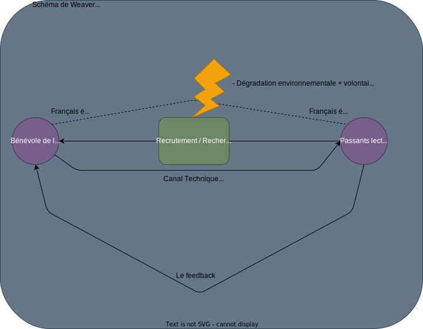

# R211 - S'informer de manière éclairée

## Sommaire

- I/ L'intention du message
- II/ Se documenter de manière éclairée
  1. Les types de documents
  2. La chauve-souris de Wuhan (2020)
  3. Désinformation et mésinformation
  4. Faits, opinions ou sentiments ?
  5. Vérifier ses sources
- III/ Méthodologie de l'expression orale
  1. Fiche "Mon mantra"
  2. Fiche "Je me remets en question"
  3. Fiche "Que du plaisir"
  4. Fiche "Voix"
  5. Fiche "Regard"
  6. Fiche "Posture"
- IV/ Présentation des sujets exposés
  > Evaluation orale n°1
- V/ Phase de recherches en classe et en autonomie en TP
- VI/ Présentation des exposés en TP

## I/ L'intention du message

> Figure 1: Intimidation
> Figure 2: Félicitation  
> Figure 3: Se marrer  
> Figure 4: Recherche de preuves  
> Figure 5: Attirer le client  
> Figure 6: susciter de la pitié

Pour que la communication soit fluide et efficace, il faut savoir distinguer action et intention, c'est à dire avoir en tête ses propres intentions dans l'acte de communication.  
On doit donc, forcément, détecter l'intention de l'autre.

## II/ Se documenter de manière éclairée

  On met en avant la raison de l'esprit loin des dogmes.

### 1. Les types de documents

Un auteur qui veut informer ses lecteurs sur un sujet précis va devoir présenter des faits de manière objective, c'est à dire exempt d'opinions personnels.  
L'intention va donc être double de renseigner, voir de sensibiliser le ou les récepteurs.

- Textes explicatifs
  - On va expliquer une situation, un événement.
  - C'est préciser les causes et les conséquences.
- Textes descriptifs
  - On decrit un objet, un animal, une personne.
  - On donne des détails.
- Textes comparatifs
  - On cherche une similitude et les resemblances
- Comptes rendus
  - Rapporter des évenements ou des paroles telles qu'elles ont été vues ou entendues

> L'intention: L'objectif du message que l'on transmet

