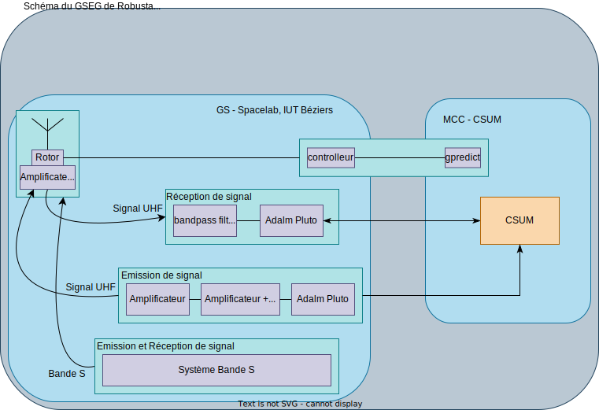
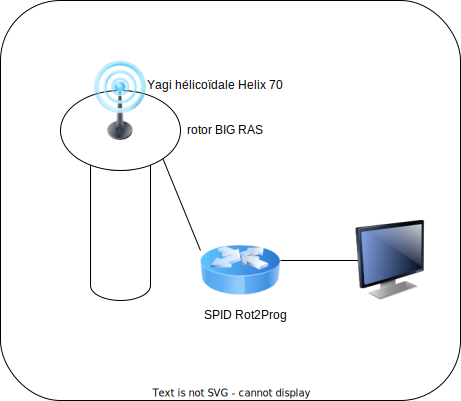

# Compte rendu de R221-TP2

## 2 - Segment Sol Robusta

1. A l’aide de la documentation fournie préciser les éléments constitutifs du segment sol Robusta.

2. Faire un schéma du segment sol Robusta à Béziers.

Le schéma du segment sol Robusta à Béziers est:

## 3 - MCC

1. A l’aide de la documentation fournie, identifier les différentes tâches que prend en charge le MCC du CSUM à Béziers.

Le MCC du CSUM à Béziers prend en charge la position GPS des satellites à tracker,
l'analyse des données transmises à et par les satellites.

2. Produire un schéma synthétique sous forme de schéma bloc.

## 4 - Etage radio

1. Sans rentrer dans les détails, cela fera l’objet de prochains TP, préciser ce que cela signifie. Autrement dit, donner les caractéristiques de ces deux bandes : fréquences et longueurs d’onde.

2. D’un point de vue télécoms, qu’est ce que cela impose pour le segment sol ?

3. A partir de la documentation générale du segment sol, préciser les paramètres télécoms de l’étage radio UHF, seul présent à l’IUT.

## 5 - Les missions

1. A la lecture de la documentation, identifier les éléments qui différentient les missions.
2. Dans votre VM visualiser les différentes missions, les paramètres et les données collectables.

Les missions possibles affichées sur l'interface sont:

- Robusta 1D
- Robusta 1F
- Robusta 1B
- Robusta 1E
- Robusta 3A
- Hydrosat
- Meteosat 9
- Generic
- ISS

## 6 - Poursuite (tracking)

### 6.1 - Pointage

1. Rappeler la raison qui rend nécessaire un pointage « précis » des satellites.

  Un pointage précis est nécessaire pour que l’antenne puisse recevoir le signal du satellite suffisament fort puis qu'il puisse est traité.

2. Rappeler la raison qui oblige à avoir un système de poursuite.

  Un système de poursuite est nécessaire pour que l’antenne puisse suivre le satellite dans le ciel.

3. Dans quel cas une poursuite n’est pas utile ?

  Un système de poursuite n'est pas utile lorsque le satélite est géostationnaire.

4. Dessiner cette architecture

5. Montrer qu’alors l’antenne motorisée devient un objet IP communiquant.

  l'antenne motorisée devient un objet IP communiquant car le moteur utilisé pour le pointage est connecté en utilisant le protocole TCP rotctld

6. A partir des caractéristiques électromagnétiques de l’antenne (dire lesquelles), déterminer la précision de pointage nécessaire.

7. Nos équipements sont-ils compatibles avec cette précision ?

### 6.2 - Calcul des coordonnées

1. Pour quelle raison les TLE doivent-ils être actualisés régulièrement ?

  Les TLE doivent être actualisés régulièrement pour que les coordonnées calculées mais aussi les données propres à la station soient les plus précises possibles.

2. Lesquels selon vous ?

  Les trajectoire des satellite ne sont pas fixes, elles ne coorespond pas forcément au calculs théorique.

3. Comment la générer ?

  Afin de pouvoir crée une base de temps rigoureuse on peut utilisé un service ntp.

4. Selon vous comment régler le zéro de l’élévation ?

5. Quelle méthode proposez vous pour régler le zéro en azimut ?

### 6.3 Poursuite d'un satellite

1. Sur votre PC installez et configurez gpredict.
2. Avec les engins spatiaux déjà programmés identifiez les paramètres nécessaire à la poursuite d’un satellite.

  Afin de pouvoir suivre un satellite on utilise l'azimut, l'élévation, son altitude

3. Sur un des sites : celestrak.org, satnogs.org ou n2yo.com, cherchez un satellite qui est ou sera prochainement visible. Récupérez son identifiant Norad, récupérez son TLE, ajoutez le à Gpredict.
4. Suite aux questions précédentes dites quelles données il faut fournir au tracker Robusta pour qu’il puisse estimer précisément les coordonnées à pointer ?
5. En déduire les aspects informatiques et logiciels impactés.
6. Dans la mission générique de votre MCC insérer le TLE du satellite choisi et lancer la mission. Vérifiez que le terminal du tracker affiche presque les mêmes azimuts et élévations que gpredict.

## 7 - Aspects réseaux

## 8 - Exploitation du segment sol de l'IUT

1. A partir des satellites visibles que vous avez sélectionnés programmez et engagez une
mission puis vérifiez que la poursuite est fonctionnelle.
2. Comparez les coordonnées calculées par gpredict sur votre PC avec les coordonnées
calculées par le MCC.

## Copyright &copy; 2023 Alexis Opolka, Lucas Simpol - All Rights Reserved
