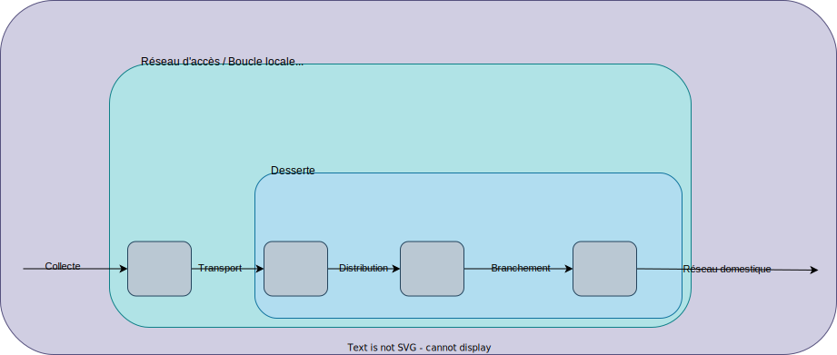

# Etude du réseau d'accès optique en France

1. ## I - Aspects structurels

    1. Question très générale pour commencer : faire les recherches adéquates afin de pouvoir faire
      un schéma faisant apparaître les différents segments du réseau de manière générale :
      collecte, transport, distribution, branchement, desserte, réseau domestique.
      Et indiquer sur votre schéma ce qu’on appelle réseau d’accès. Trouver l’autre nom du réseau d’accès.

        Le `réseau d'accès` est aussi appelé `boucle locale`, il est définit
        par le segment NRO-Abonné.

        

    1. Décrire rapidement les réseaux d’accès xDSL.

        Le terme xDSL est un terme référrant plusieurs technologies dont deux familles
        de technologies étant:

        - La [SDSL (Symmetric Digital Subscriber Line)](https://en.wikipedia.org/wiki/Symmetric_digital_subscriber_line)
        - L'[ADSL (Asymmetric Digital Subscriber Line)](https://www.arcep.fr/la-regulation/grands-dossiers-reseaux-fixes/le-haut-debit-fixe-cable-adsl-vdsl/lacces-haut-debit-via-ladsl.html)

        Les réseaux d'accès xDSL sont des réseaux cuivrés étant principalement soit asymétriques, soit symétriques.

    1. Rechercher les différents acronymes FTTxx et ce qu’ils signifient (jusqu’où arrive la fibre).
        Il n’est pas nécessaire d’être exhaustif.

        - [FTTH `Fiber To The Home`](): Approche Réseaux où la fibre arrive à une boxe ou aux murs de la maison d'un particulier.
        - [FTTE `Fiber To The Edge`](https://en.wikipedia.org/wiki/Fiber_to_the_telecom_enclosure): Approche Réseaux éliminant le besoin d'une grille intermédiaire d'interconnexion entre les appareils `edge` et la grille principale du réseau.
        - [FTTB `Fiber To The Building` ou `Fiber To The Business`](): Approche Réseaux où la fibre arrive à la limite d'un batiment, la connexion des clients est faite avec des technologies alternatives.

    1. Dans   le   cas   de   la   fibre   optique,   expliquer   ce   qu’est   une   architecture   point   à   point,   et   une architecture point multipoint.

        - Une architecture P2P

    3. Les boucles locales optiques sont mutualisées (BLOM) ou dédiées (BLOD). Expliquer.
        Dans la suite, on ne s’intéressera pas aux BLOD.

    4. On considère un réseau GPON.  
        Que veut dire le sigle GPON ?
        Qu’est-ce qu’un réseau GPON ?
        Préciser quelle est la norme des réseaux GPON.

    5. Faire un schéma représentatif d’un réseau GPON avec : un NRO, plusieurs SRO, plusieurs PBO, plusieurs PTO, des clients.

        Le but est de visualiser l’architecture globale : un NRO peut-il être relié à un seul SRO ou plusieurs,
        etc. Les différents segments de réseau vus question 1 doivent apparaître.
        Pour chaque élément (NRO, SRO, PBO, PTO) donner une description rapide et significative pour vous.

        Trouver où se trouvent les PM (Points de mutualisation) sur le schéma et expliquer ce que cela signifie
        (pourquoi on les appelle ainsi).  
        Chercher ensuite ce qu’est un OLT et préciser sur le schéma où il sera.  
        Chercher aussi ce qu’est un ONU et préciser sur le schéma où il sera.

    6. Toujours dans le cas d’un réseau GPON, on considère une fibre qui arrive sur un SRO depuis
        le NRO. Quel est l’équipement qui va permettre à partir de cette fibre de desservir plusieurs PBO ?

    7. On distingue les zones de déploiement très denses (ZTD) des zones de déploiement moins
        denses (ZMD). De plus, dans les ZTD sont définies des zones de basse densité, ZTD-BD. Trouver
        comment, en France, se répartit le nombre total de lignes entre les trois types de zones.

    8. Ordres de grandeur :

        Un NRO peut desservir combien d’abonnés ?
        Le segment de fibre NRO-SRO peut faire jusqu’à quelle longueur en ZTD ? Et en ZMD ?
        Un PM peut desservir combien de lignes ?

    9. Expliciter ce que veulent dire le sens montant et le sens descendant (utiliser votre schéma pour être précis).

    10. En réseau FTTH, la desserte peut être mono-fibre (1 seule fibre est affectée par client)  ou
        multi-fibres (pour chaque client, 1 fibre est dédiée à chaque opérateur).
        Faire   un   schéma   au   niveau   du   PM   avec   des   fibres   arrivant   d’un   coté,   provenant   de   plusieurs
        opérateurs, et des fibres repartant de l’autre coté, vers plusieurs clients, lorsque la desserte est mono-
        fibre puis recommencer lorsque la desserte est multi-fibres.
        La desserte multi-fibres est intéressante lorsqu’un abonné change d’opérateur. Expliquer.

    11. En réseau FTTH, il existe différentes situations réglementaires :

        En ZTD, cas des immeubles de plus de 12 logements
        En ZTD, cas général des immeubles de moins de 12 logements
        En ZTD, cas particulier des immeubles isolés de moins de 12 logements
        En ZTD, poches de basse densité
        En ZMD

        Pour chacune de ces 5 situations, trouver où sera situé le PM, ainsi que le PBO, combien de lignes le
        PM peut desservir, et si la desserte est  mono-fibre ou multi-fibres.

        Pour les situations où la desserte est  multi-fibres, trouver pourquoi.

    12. Dans quel type de situation la fibre multimode est-elle utilisée ?
        Trouver également les différentes qualités de fibres multimodes qui existent.

2. ## II - Spécifications télécoms du réseau GPON

3. ## III - Perspectives d'évolution

## Sources

- 
- 

## Copyright &copy; 2023 Alexis Opolka - All Rights Reserved
