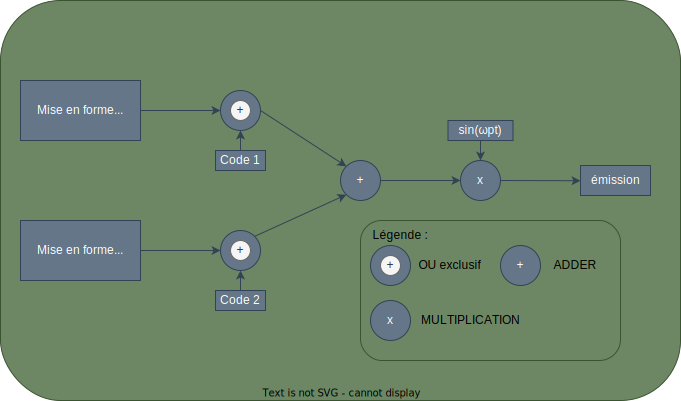
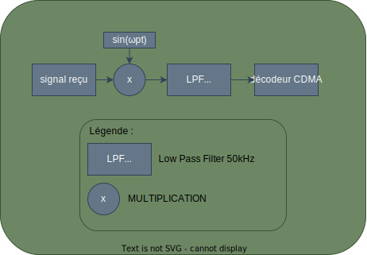

---
Author:
  - Alexis O.
  - Thibault Garcia
  - Mathys D.
Subject: R402-TP - CDMA
Company: IUT de Béziers
Copyright: All Rights Reserved
---

# R401 - TP2 - CDMA

Le but de ce TP est de réaliser un système CDMA à deux signaux numériques différents (en pratique, le
CDMA permet d'en transmettre un nombre plus important).

## Préparation

- Faire un schéma bloc représentant les différentes étapes pour émettre deux signaux en CDMA

  

Les séquences utilisées « 0 » et « 1 » avec la carte TIMS sont des codes orthogonaux ; on peut alors
transmettre les deux signaux codés en même temps sur un même canal et les retrouver en réception.

- Rappeler comment on vérifie que deux codes sont orthogonaux.

    On fait un produit (en utilisant l'opération OU exclusif) où le résultat doit être nul (égale à zéro).

- Appliquer cette méthode pour les codes:

  - `001101010011`
  - `101111001000`

  

  Sont-ils orthogonaux ?

    Les codes ci-dessus sont bien orthogonaux.

## Premier signal

On souhaite réaliser un étalement d'un message M
(signal numérique de débit 6,25 kbits/s par une séquence de chips (code pseudo-aléatoire))
C1 de fréquence 50 kchips/s.

- A l'aide de cartes **Digital Utilities** et de l’horloge à 100 kHz,
réaliser les deux horloges, une à 6,25 kHz et l'autre à 50 kHz.

  On va prendre notre la fréquence de notre horloge qui sera divisée une première fois par `2`,
  afin de nous donner $50$ kHz, puis nous allons à nouveau la diviser par `8` ($\frac{f_{horloge} \div 2}{4}$) afin d'obtenir $6.25$ kHz.

- La première horloge commande la carte **Sequence Generator** qui délivre alors le signal numérique M1
  (sortie X rouge) ; la deuxième horloge commande la carte **Multiple Sequence Source** qui fabrique le code
  C1 (entrée CLK et sortie PN1). On règlera à l'intérieur de la carte la séquence « 0 ».

  

- Observer ces deux signaux. Mesurer la durée d'un bit ; la durée d'un chip.  
  Vérifier alors que les réglages sont corrects

  

  | Valeur Recherchée | Durée           |
  | ----------------- | --------------- |
  | un Bit            | $160/164 \mu s$ |
  | un chip           | $20 \mu s$      |

  - Durée d'un chip:

    

  - Durée d'un bit:

    

> [!NOTE]
> Montrer vos réglages à l'enseignant.

Pour réaliser l'étalement de spectre par séquence directe (DSSS[^1]), on utilisera le OU exclusif de la carte
**Multiple Sequence Source** entre le signal M1 et le code C1.

[^1]: Direct-sequence spread spectrum

- Réaliser le montage. Observer le signal M1 et le signal en sortie du OU exclusif.  
  Observer leur spectre respectif. Que remarque-t-on ?  
  Vérifier la valeur de l'étalement de spectre.

  - Signaux:
    

  - Spectre M1:

    

  - Spectre en sortie du OU exclusif:

    

  On voit bien qu'il y a un étalement de spectre avec une valeur de $50 \text{ kHz}$.

> [!NOTE]
> Montrer vos résultats à l'enseignant.

## Deuxième signal

- **En utilisant une autre couleur de câble**, la séquence « 1 » à l'intérieur de la carte **Multiple Sequence
Source** et une deuxième carte **Sequence Generator**, réaliser une deuxième voie émetteur (étalement d'un
deuxième message M2).

  > [!NOTE]
  > Le signal M2 sera caractérisé dans le montage par les cables verts.

  

  - Le signal M2:

    

- Vérifier que ce nouveau message étalé utilise la même bande de fréquence que le premier message.

  

  On peut constater que l'étalement du signal M2 est bien de $50 \text{ kHz}$.

> [!NOTE]
> Montrer vos réglages à l'enseignant.

## Modulation

- Réaliser l'addition des 2 messages étalés en utilisant le module  Adder.  
  Visualiser le signal somme, expliquer sa forme et ses 4  (3 ? ) niveaux.

  

  - Le signal:

    

  On peut voir qu'il y a 3 niveaux qui sont: $+3.76$, $0$, $-3.76$.  
  On peut aussi constater que sa forme est celle aditionnée des deux signaux.

- Observer son spectre. Que remarque-t-on ?

  

  On remarque que l'étalement du spectre est toujours présent à $50 \text{ kHz}$.

- La modulation complète sera réalisée après transposition de fréquence.
  Représenter cette opération par un schéma-bloc.

  

- A  l'aide de la carte **Multiplier**, réaliser la modulation avec une fréquence porteuse de 100 kHz.

  

- Observer le spectre du signal modulé.

  

  On voit que le spectre est modulé à $100 \text{ kHz}$, fréquence de la porteuse.

> [!NOTE]
> Montrer vos réglages à l'enseignant.

- Expliquer l'enchaînement des opérations nécessaires à la récupération du signal CDMA.
  On représentera ces opérations sur un schéma-bloc.

  On va devoir multiplier le signal avec la porteuse, puis l'on utilisera un filtre passe bas
  à la fréquence de la porteuse afin de récupérer le signal CDMA de départ.

  

- Réaliser alors la démodulation complète.

  

> [!NOTE]
> Montrer vos réglages à l'enseignant.

## Récupération des messages

Pour retrouver le message `M1`, il faut multiplier le signal somme par la séquence de code C1.  
Pour cela, il faut disposer en réception de la même séquence pseudo-aléatoire que celle qui a servi en
émission à étaler le spectre.

- Régler la carte **CDMA Decodeur** sur la séquence `0`.  
  Pour synchroniser le décodeur, il faut relier la borne **Clock Sy** avec l'horloge $50 \text{ kHz}$
  (syncrhonisation de l'horloge) et la borne **RS** avec la sortie **Sync** du **CDMA Encodeur (Multiple Sequence Source)**
  (pour la synchronisation du début de la séance de code).

  

Pour avoir plus de chance de réussir la manipulation et, compte tenu du fait que le filtre de démodulation n’a pas exactement
la bonne valeur de fréquence de coupure, réaliser la multiplication en supprimant entièrement la partie modulation/démodulation.

- Ce signal doit être remis en forme avec la carte **CDMA Decodeur**.  
  Observer le signal en sortie du comparateur ( **‖** ) et vérifier que l'on récupère le message M1.

  

  > [!NOTE]
  > Montrer vos résultats à l'enseignant.

- Que faut-il faire pour récupérer le message M2 ?
- Réaliser le montage et retrouver le message M2.

  > [!NOTE]
  > Montrer vos résultats à l'enseignant.
