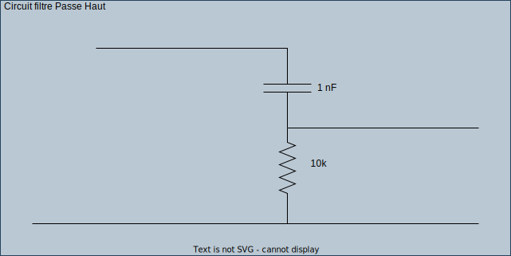

---
Author:
  - Alexis Opolka
  - Mathys Domergue
Subject: R403-TP1
Company: IUT de Béziers
Copyright: All Rights Reserved
---

# R403 - TP1

> [!NOTE]
> Sur ce TP, nous utiliserons un `Passe haut`.

## Etablir $H(j \omega)$ et $\frac{\omega_c}{f_c}$

Nous avons:

$$

  H(j \omega) = \frac{u_s}{u_e} \\
  \frac{\omega_c}{f_c}

$$

## Déterminer RC pour $F_e \approx 10 \text{ khz}$

## GBF Oscillo

> [!NOTE]
> Phi se lit sur l'axe vertical de gauche, $u_e$ et $u_s$ se lisent sur l'axe vertical de droite.

> [!TIP]
> Cliquez sur l'image pour ouvrir sa version en ligne.
