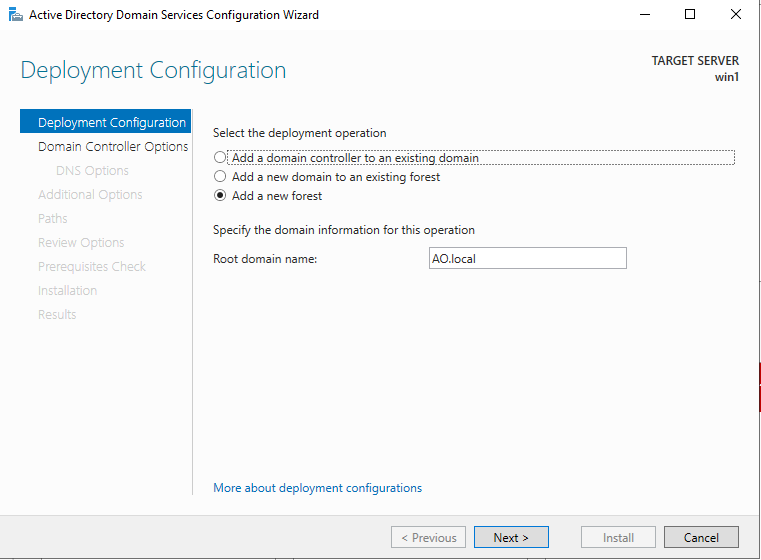
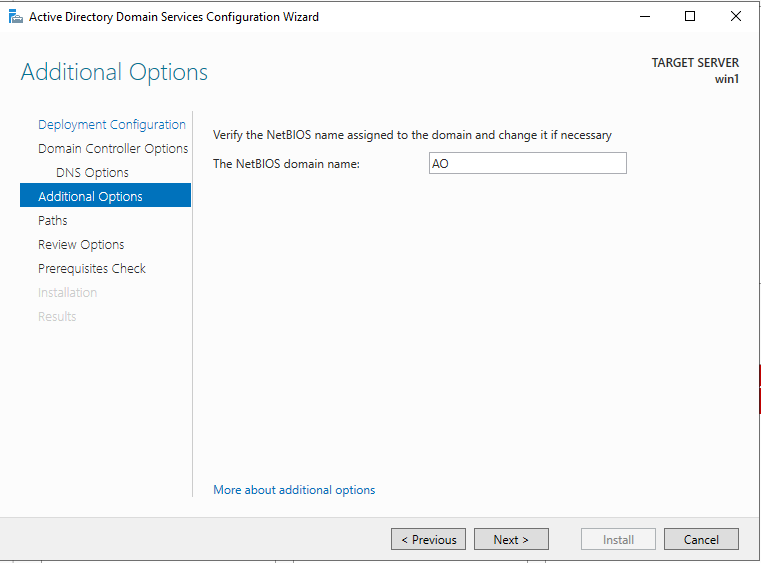
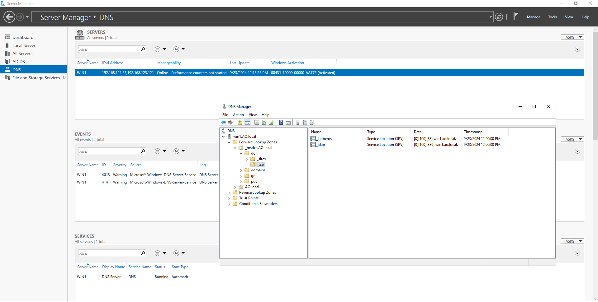
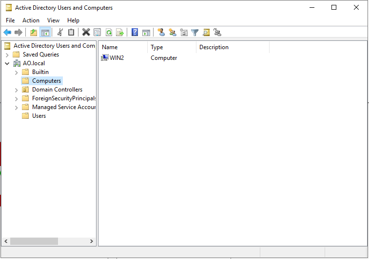

# R509-TP1 - Windows AD

## 1 - Pré-Requis

## 2 - Votre attention !

On installe les dépendances de virtualisation, RDP et ZSH:

```sh
sudo apt -y install qemu-system libvirt-daemon-system freerdp2-x11 zsh
```

Après avoir installé Vagrant, on installe les plugins nécessaires:

```sh
vagrant plugin install vagrant-libvirt
vagrant plugin install vagrant-scp
vagrant plugin install winrm-fs
vagrant plugin install winrm-elevated
```

Ensuite, on passe sur ZSH puis on clone la maquette Vagrant
et on la provisionne:

```sh
zsh
git clone https://github.com/pushou/but-503-vagrant.git maquette-vagrant
cd maquette-vagrant
virsh -c qemu:///system net-create ./bridge-vagrant.xml
./run.sh
```

On peut maintenant lister les deux VM Windows:

- Win-1

  ```sh
  vagrant winrm -s cmd -c ipconfig win-1
  ```

  nous donne:

  ```pwsh
  Windows IP Configuration


  Ethernet adapter Ethernet:

    Connection-specific DNS Suffix  . : 
    Link-local IPv6 Address . . . . . : fe80::ac58:2cce:9299:4605%7
    IPv4 Address. . . . . . . . . . . : 192.168.121.53
    Subnet Mask . . . . . . . . . . . : 255.255.255.0
    Default Gateway . . . . . . . . . : 192.168.121.1

  Ethernet adapter Ethernet 2:

    Connection-specific DNS Suffix  . : 
    Link-local IPv6 Address . . . . . : fe80::4368:ba5:9c8e:c48b%6
    IPv4 Address. . . . . . . . . . . : 192.168.123.121
    Subnet Mask . . . . . . . . . . . : 255.255.255.0
    Default Gateway . . . . . . . . . : 
  ```

- Win-2

  ```sh
  vagrant winrm -s cmd -c ipconfig win-1
  ```

  nous donne:

  ```pwsh
  Windows IP Configuration


  Ethernet adapter Ethernet:

    Connection-specific DNS Suffix  . : 
    Link-local IPv6 Address . . . . . : fe80::c963:d10a:738b:fd80%5
    IPv4 Address. . . . . . . . . . . : 192.168.121.144
    Subnet Mask . . . . . . . . . . . : 255.255.255.0
    Default Gateway . . . . . . . . . : 192.168.121.1

  Ethernet adapter Ethernet 2:

    Connection-specific DNS Suffix  . : 
    Link-local IPv6 Address . . . . . : fe80::8e03:7889:4cda:ed22%4
    IPv4 Address. . . . . . . . . . . : 192.168.123.122
    Subnet Mask . . . . . . . . . . . : 255.255.255.0
    Default Gateway . . . . . . . . . : 
  ```

## 2.1 - Tips & Tricks Vagrant

## 3 - Installation d'un "Domain Controller" sur win-1 et rattachement de win-2 au domaine

On se rattache au RDP de la machine:

```sh
xfreerdp /u:vagrant /p:vagrant /v:192.168.121.53:3389 /cert-ignore /dynamic-resolution
```

> [!NOTE]
> L'icone de xfreerdp est belle:
>
> 


Après avoir créé le domaine sur `win-1`, on lance un shell sur `Win-2`

```sh
vagrant ssh win-2
```

On installe d'abord une nouvelle version de Powershell, c'est un prérequis afin
que l'environnement PowerShell soit configuré.

```cmd
msiexec.exe /package PowerShell-7.4.5-win-x64.msi /quiet ADD_EXPLORER_CONTEXT_MENU_OPENPOWERSHELL=1 ADD_FILE_CONTEXT_MENU_RUNPOWERSHELL=1 E
NABLE_PSREMOTING=1 REGISTER_MANIFEST=1 USE_MU=1 ENABLE_MU=1 ADD_PATH=1
```

On fait ensuite:

```pwsh
ipconfig
Set-DnsClientServerAddress -InterfaceIndex <interface> -ServerAddresses ("192.168.121.53")
```

Maintenant que l'on fait:

```pwsh
nslookup
```

on obtient:

```pwsh
Default Server:  win1
Address:  192.168.121.53
```






## 4 - Tools

On installe sur `win-1` et `win-2` Git via Chocolatey:

```
choco install git
```
